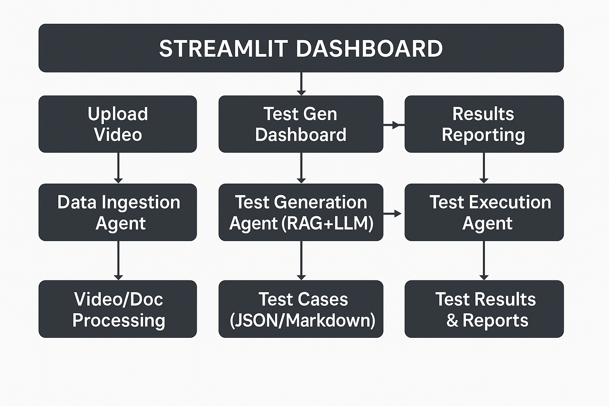

# 🤖 QAgenie - AI-Powered QA Testing Platform

## 📋 Project Overview

**QAgenie** is an intelligent, end-to-end QA automation platform that revolutionizes how software testing is done. It combines **AI-powered test generation**, **automated test execution**, and **comprehensive reporting** into a single, user-friendly platform.

## 🎯 What It Can Do

### 1. **Intelligent Test Case Generation**

- 📹 **Video-to-Tests**: Upload demo videos and automatically generate test cases.
- 🔗 **YouTube Integration**: Process YouTube how-to videos for test generation.
- 📄 **Document Processing**: Convert requirements docs into executable tests.
- 🤖 **AI-Powered**: Uses RAG (Retrieval-Augmented Generation) + LLM for smart test creation.

### 2. **Automated Test Execution**

- 🎭 **Multi-Browser Testing**: Chrome, Firefox, and Safari support.
- 📱 **Cross-Platform**: Desktop and mobile testing.
- ⚡ **Parallel Execution**: Run tests simultaneously for faster results.
- 🎬 **Rich Artifacts**: Screenshots, videos, and traces on failures.

### 3. **Comprehensive Analytics & Reporting**

- 📊 **Real-time Dashboards**: Live execution monitoring.
- 📈 **Trend Analysis**: Historical performance tracking.
- 📄 **Multiple Export Formats**: JSON, CSV, HTML, and PDF reports.
- 🔍 **Detailed Insights**: Failure analysis and recommendations.

## 🏗️ How It Works

### **System Architecture**



### **Core Workflow**

#### **Phase 1: Data Ingestion** 🎬

1. **Video Upload**: User uploads demo videos (local files or YouTube URLs) or provides direct video links.
2. **Content Processing**: AI extracts visual elements, user interactions, and workflows.
3. **Transcript Generation**: Audio-to-text conversion using YouTube API or Whisper for context understanding.
4. **Chunk Analysis**: Video is segmented into logical test scenarios.

#### **Phase 2: Test Generation** 🤖

1. **RAG Pipeline**: A vector database stores processed content for retrieval.
2. **LLM Analysis**: GPT-4 analyzes video content and generates test scenarios.
3. **Test Case Creation**: Structured test cases with steps, assertions, and priorities are created.
4. **Format Output**: Test cases are available in JSON formats.

#### **Phase 3: Test Execution** 🚀

1. **Playwright Integration**: Converts test cases to executable Playwright scripts.
2. **Multi-Browser Execution**: Runs tests across different browsers and devices.
3. **Real-time Monitoring**: Live execution status and progress tracking.
4. **Artifact Collection**: Screenshots, videos, and logs are collected for debugging.

#### **Phase 4: Results & Reporting** 📊

1. **Analytics Dashboard**: Visual representation of test results.
2. **Trend Analysis**: Historical performance and quality metrics.
3. **Report Generation**: Comprehensive reports for stakeholders.
4. **Failure Analysis**: AI-powered insights into test failures.

## 🛠️ Technology Stack

### **Backend Technologies**

- **Python 3.13**: Core application language.
- **LangChain**: RAG pipeline and LLM orchestration.
- **OpenAI GPT-4o**: AI-powered test generation.
- **FAISS & ChromaDB**: Vector databases for content retrieval.
- **Playwright**: Browser automation and testing.
- **PyTube & yt-dlp**: YouTube video downloading.
- **YouTube Transcript API**: Automated transcript extraction.
- **Whisper**: Audio transcription fallback.

### **Frontend & UI**

- **Streamlit**: Interactive web dashboard.
- **Plotly**: Advanced data visualizations.
- **Pandas**: Data manipulation and analysis.
- **Custom CSS**: Enhanced UI styling.

### **AI & ML Components**

- **Large Language Models**: OpenAI GPT-4o for intelligent test generation.
- **RAG Pipeline**: Context-aware test generation using vector retrieval.
- **Vector Databases**: FAISS and ChromaDB for semantic search.
- **NLP**: Text processing and understanding with LangChain.
- **Speech-to-Text**: YouTube Transcript API with Whisper fallback.
- **Embeddings**: OpenAI embeddings for content vectorization.

## 🚀 Key Features

### 1. **Multi-Modal Input Support**

- 📹 **Video Files**: Direct upload of MP4, AVI, MOV, MKV, files
- 🔗 **YouTube URLs**: Direct URL processing with multiple fallback methods
- 🌐 **Direct URLs**: Support for direct video file links
- 🧪 **Mock Data**: Built-in test data for development and demos
- 📄 **Future**: Documentation (PDF, Word, Markdown)
- ✍️ **Manual Input**: Custom test scenario definition

### 2. **Intelligent Test Generation**

- 🎯 **Core User Flows**: Essential application workflows.
- 🔄 **Edge Cases**: Boundary conditions and error scenarios.
- 📱 **Cross-Browser**: Chrome, Firefox, Safari compatibility.
- ♿ **Accessibility**: WCAG compliance testing.
- ⚡ **Performance**: Load time and responsiveness tests.

### 3. **Advanced Execution Capabilities**

- 🔄 **Parallel Execution**: Multiple tests simultaneously.
- 📊 **Real-time Monitoring**: Live execution dashboard.
- 🎬 **Rich Artifacts**: Screenshots, videos, and traces.
- 🐛 **Debug Support**: Detailed error reporting.

### 4. **Comprehensive Analytics**

- 📈 **Trend Analysis**: Performance over time.
- 🎯 **Success Metrics**: Pass/fail rates and patterns.
- 🔍 **Failure Analysis**: AI-powered root cause analysis.
- 📊 **Custom Dashboards**: Configurable visualizations.

## 💡 Use Cases

### 1. **QA Teams**

- Accelerate test case creation from requirements.
- Reduce manual testing effort.
- Improve test coverage and quality.

### 2. **Development Teams**

- Quick regression testing after code changes.
- Automated smoke tests for deployments.
- Cross-browser compatibility validation.

### 3. **Product Teams**

- Validate user journeys and workflows.
- Ensure feature functionality across platforms.
- Performance and accessibility compliance.

### 4. **Startups & SMEs**

- Cost-effective QA automation.
- Rapid testing setup for MVPs.
- Scalable testing infrastructure.

## 🎯 Getting Started

### 1. **Setup & Installation**

```bash
# Clone the repository
git clone https://github.com/jiten0709/QAAgent-Task-JitenParmar.git
cd QAAgent-Task-JitenParmar

# Set up virtual environment (Python 3.11+ recommended)
python -m venv venv
source venv/bin/activate  # On Mac/Linux
# On Windows: venv\Scripts\activate

# Install dependencies
pip install -r requirements.txt

# Install Playwright browsers
playwright install

# Set up environment variables
cp .env.example .env
# Edit .env file and add your OpenAI API key:
# OPENAI_API_KEY=sk-your-api-key-here
```

### 2. **Run the Application**

```bash
# Start the Streamlit dashboard
streamlit run run_app.py

# Or use Python directly
python run_app.py

# Access the application at:
# 🌐 Local: http://localhost:8501
# 🌐 Network: http://your-ip:8501
```

### 3. **Test the Setup**

```bash
# Run sample tests to verify Playwright setup
pytest src/tests/generated/test_sample.py -v

# Check if all dependencies are installed correctly
python -c "import streamlit, playwright, openai, langchain; print('✅ All dependencies installed successfully')"
```

### 4. **First Time Setup**

1. **Configure OpenAI API Key**:

   - Go to Settings in the app sidebar
   - Enter your OpenAI API key (starts with `sk-`)
   - Test the connection

2. **Try Mock Data**:

   - Use "test" as the video URL to generate sample test cases
   - This helps verify the system works before using real videos

3. **Upload Your First Video**:
   - Upload a local video file (MP4, AVI, MOV, MKV, WebM) or paste a YouTube URL in the Test Generation page
   - Select test categories (Core User Flows, Edge Cases, etc.)
   - Configure processing options (chunk duration, language, etc.)
   - Click "Process Video" then "Generate Test Cases"

## � Current Implementation Status

### ✅ **Fully Implemented**

- **Data Ingestion Agent**: YouTube video download and transcript extraction
- **File Upload Support**: Direct video file upload with multiple format support (MP4, AVI, MOV, MKV, WebM)
- **Test Generator Agent**: AI-powered test case generation with RAG
- **Streamlit Dashboard**: Complete web interface with multiple pages
- **Test Execution Framework**: Playwright test execution with multiple browsers
- **Vector Storage**: FAISS and ChromaDB integration for content retrieval
- **Mock Data Testing**: Built-in test data for development and demos
- **Multi-format Output**: JSON and Markdown test case exports
- **Multiple Input Methods**: Local files, YouTube URLs, and direct video links

## �🔮 Future Enhancements

- **Advanced Test Execution**: Parallel test execution across browsers
- **Comprehensive Reporting**: Historical trend analysis and detailed reports
- **Test Result Analytics**: Advanced metrics and failure analysis
- 🤖 **Advanced AI Models**: Integration with Claude, Gemini.
- 🔄 **CI/CD Integration**: GitHub Actions, Jenkins support.
- 📱 **Mobile App Testing**: React Native, Flutter support.
- 🌐 **API Testing**: REST/GraphQL endpoint validation.
- 🎯 **Visual Testing**: UI component regression testing.
- 🔒 **Security Testing**: Vulnerability assessment.
- ☁️ **Cloud Deployment**: AWS, Azure, GCP

## 🛠️ Troubleshooting

### **Common Issues**

#### 1. **OpenAI API Key Issues**

```bash
# Error: Invalid API key or connection failed
# Solution: Verify your API key in Settings
# Make sure it starts with 'sk-' and has sufficient credits
```

#### 2. **YouTube Download Failures**

```bash
# Error: Video download failed
# Solution: Try different YouTube URLs or use "test" for mock data
# Some videos may be region-locked or have download restrictions
```

#### 3. **Playwright Browser Issues**

```bash
# Error: Browser not found
# Solution: Reinstall Playwright browsers
playwright install
```

#### 4. **Import Errors**

```bash
# Error: Module not found
# Solution: Ensure virtual environment is activated and dependencies installed
pip install -r requirements.txt
```

#### 5. **Permission Errors**

```bash
# Error: Permission denied when creating directories
# Solution: Check write permissions for src/data/ directory
chmod 755 src/data/
```

### **Getting Help**

- 📧 **Issues**: Report bugs on [GitHub Issues](https://github.com/jiten0709/QAAgent-Task-JitenParmar/issues)
- 📖 **Documentation**: Check the code comments and docstrings
- 🧪 **Testing**: Use mock data ("test" URL) to verify functionality

# ~ Made with ❤️ by Jiten Parmar
